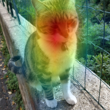

# pytorch-CAM
small and easy-to-use package to create Class ActiviationMaps (CAMs) for PyTorch models. Currently supported models are: 

- ResNet

## How to use 

First initialize your model and wrap it with CAM class:
```python
model = resnet18(pretrained=True).cuda()
model=model.eval()
# Initialize the CAM module
cam = CAM(model)
```

Make a prediction:

```python 

# Load an image
img = Image.open("./example_pictures/cat.jpg")


# Define Augmentation steps.
normalize = transforms.Normalize(mean=[0.485, 0.456, 0.406],std=[0.229, 0.224, 0.225])
PIL_tops = transforms.Compose([transforms.Resize(256),transforms.CenterCrop(224)])
tensor_tops = transforms.Compose([transforms.ToTensor(), normalize])
cropped_img = PIL_tops(img)
trans_img = tensor_tops(cropped_img)

# Predict
out=model(trans_img.unsqueeze(0).cuda())
```

Now visualize results for a given class:

```python
cam.visualize(282,cropped_img,alpha=0.8)
```


